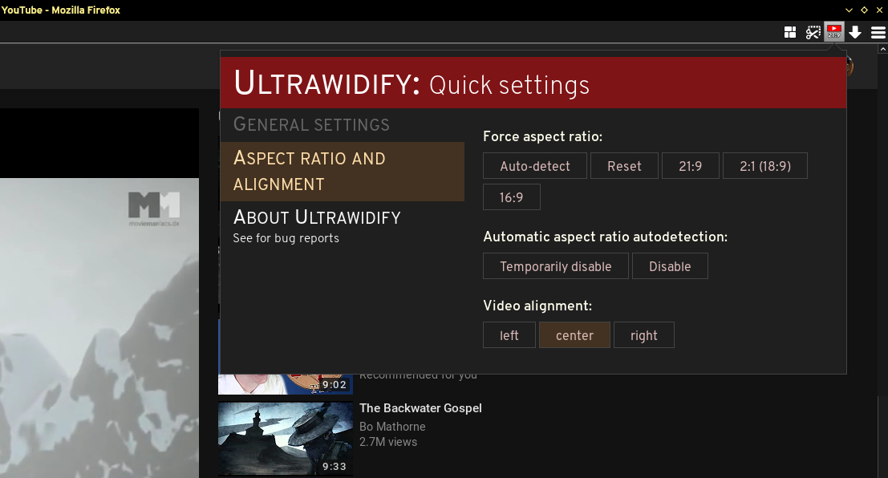

# Ultrawidify — aspect ratio fixer for youtube and netflix

## TL;DR

If you own an ultrawide monitor, you have probably noticed that sometimes videos aren't encoded properly — they feature black bars on all four sides. This could happen because someone was incompetent (note: as far as youtube is concerned, improperly rendered videos might be due to youtube's implementation of certain new features). The extension kinda fixes that by doing this:

Works (tested!) on Youtube and Netflix, but you can try your luck with other sites as well. Available for [Firefox (v2.0.3)](https://addons.mozilla.org/en/firefox/addon/ultrawidify/) and [Chrome (v2.0.2)](https://chrome.google.com/webstore/detail/ultrawidify/dndehlekllfkaijdlokmmicgnlanfjbi). Should support theater mode on youtube, iframes only supported on fullscreen.

Youtube demo of autodetection stuff can be found [here](https://www.youtube.com/watch?v=j2xn1WpbtCQ).

## Beggathon

Working on this extension takes time, coffee and motivation. If you want to buy me a beer or something, you can [use this link to send me motivation](https://www.paypal.me/tamius). Money will be spent on Netflix and coffee/tea. 

## The long version

The technology has been here for a while, but plenty of people don't know how to properly encode a video (despite the fact [youtube has an article that explains aspect ratios](https://support.google.com/youtube/answer/6375112)). Plenty of people surprisingly includes major Holywood studios, such as [Marvel](https://www.youtube.com/watch?v=Ke1Y3P9D0Bc), [Disney](https://www.youtube.com/watch?v=yCOPJi0Urq4), [Dreamworks](https://www.youtube.com/watch?v=oKiYuIsPxYk), [Warner Brothers](https://www.youtube.com/watch?v=VYZ3U1inHA4), [Sony](https://www.youtube.com/watch?v=7BWWWQzTpNU), et cetera. You'd think that this is the one thing Holywood studios and people who make [music videos for a living](https://www.youtube.com/watch?v=c6Mx2mxpaCY) would know how to do right, but they don't. This extension is here to fix that.

## Features

* **Fit video to width/height**
* **Force specific aspect ratio**
* **Attempts to automatically detect aspect ratio**
* ~~**Rebindable shortcuts**~~ temporarily off

### User interface

Most quick options for a page are accessible through a button in the extension bar. The options are pretty self-explanatory.

### Default keyboard shortcuts

`w`   - fit to width  
`e`   - fit to height  
`r`   - reset

`a`   - attempt to automatically determine the aspect ratio 

`s`   - force 16:9  
`d`   - force 21:9  
`x`   - force 18:9  

### About aspect ratio autodetection

Aspect ratio autodetection is achieved by performing some black magic every 30-something milliseconds. This currently can't be turned off by default. If this extension makes video sites lag too much, open an issue and include your hardware and OS — **this is important for me to know in order to better optimize autodetection.**.

Manually triggering aspect ratio change will suspend automatic aspect ratio detection for until the page is refreshed, although it'll maybe unsuspend itself when video is changed. I don't know for certain.

## Installing

### Permanent install / stable

[v2.1.0 — Regular version — download from AMO](https://addons.mozilla.org/en/firefox/addon/ultrawidify/)

[v2.1.0 — Regular version — download from Chrome store](https://chrome.google.com/webstore/detail/ultrawidify/dndehlekllfkaijdlokmmicgnlanfjbi)

### Installing the current, github version

1. Clone this repo
2. Open up Firefox
3. Go to `about:debugging`
4. Add temporary addon
5. Browse to wherever you saved it and select manifest.json

## Known issues

* Netflix autodetection not working in Chrome, wontfix as issue is fundamentally unfixable. (Although a different kind of workaround could probably be put in place, but don't count on it)

## Plans for the future

* Edge port
* Improvements to autodetection

## Changelog

### v2.1.1 (FF/Amo)

* Fixed issue #20 — aspect ratio autodetection should now start on subsequent videos as well.
* Netflix sometimes always showed 'no video detected' warning. Popup and background script now periodically poll for `hasVideos` property.

### v2.1.0 (Chrome)

* Popup should work more reliably now
* Twitch works ... kinda but not always

### v2.0.3 

* Fixed the bug where Netflix videos weren't vertically centered in Firefox 57+ (not present in Chrome or FF 56 or earlier)

### v2.0.2

v2.0.1, but UI in the extension button now also works in Chrome.

### v2.0.1

* Autodetection: aspect ratio is no longer corrected if the detected difference is too small to make a meaningful difference

### v2.0

* Completely rewritten
* Automatic aspect ratio detection works on Youtube _and_ Netflix
* Added popup for quick actions (serves as a replacement for player UI)
* Restored settings page for keybinds.

Getting automatic aspect ratio detection required some hacks, not sure how easy will be to port to chrome.

### v2.0a1

The extension is being rewritten almost ground-up, around automatic aspect ratio detection. By default, this extension now only works in fullscreen, but due to some simplification it should work on most sites. As direct result of this simplification:

* The UI is completely gone
* Ability to add custom sites has been scrapped (might get implemented later on if some sites are a bit more problematic
* Extension broken up between smaller files, this time the proper way
* Added "the impossible aspect ratio autodetection"
* Zoom/unzoom options are gone
* Can't customize keybinds yet

### v1.3a1

* Adding ability to add custom sites (in progress)
* Most of the extension is being completely rewritten to accomodate that feature, which means there's a serious regression with Netflix support (no netflix at the moment)
* I'm also trying to break the 1500 line behemoth into smaller files.

### v1.2.1

* Fixed the bugs which caused aspect ratio to not be calculated properly.
* Introduced further changes that allow me to not keep two separate version for Firefox and Chrome.

### v1.2.0

* Auto-aspect ratio detection on netflix
* initial port to Chrome

### v1.1.1

* Fixed zooming issue on netflix
* Ultrawidify shortcuts > youtube/netflix shortcuts
* Fixed 'settings' page
* Fixed 'settings' (wrench button) popup on youtube (it was broken by one of the previous updates)

### v1.1.0

* Introduced Netflix support.

As Netflix relies on extension re-initializing at least the UI ***a lot***, the optimization introduced in 1.0.2 was reversed (as waiting 2 seconds for the UI to appear is just too much). 

Furthermore, triggering UI re-initialisation on onUpdated events turned out to not be the proper way to go: immediately after the extension is initialized, onUpdated gets triggered even more often than your average Buzzfeed writer/reader. But change the episode on Netflix and suddenly, onUpdated gets barely triggered at all — which means that more often than not, the UI extension injects into the page wasn't visible. (the fuck, really)

This is why Netflix uses another function that manually checks whether the player bar is present. Ideally that check happens every tenth of a second, but Firefox may be limiting that to one per second.

###v1.0.2  

The 'extension sometimes not working' bug was fixed (by having extension try to setup every time a page got updated), but the fix had some problems. Namely, the extension would re-initiate (complete with re-adding the entire UI) itself very _very_ often. 

This could be a problem, so it was fixed. Extension is notified of updates only every ~2 seconds (which absorbs most of the "page was updated" events on page load) and doesn't attempt to reload the UI if the UI was already loaded. (Unless `debugmsg` is set to true. It's generally not, but any commits to this repo could potentially still have it enabled).

### v1.0.1

Fixed the bug where sometimes the extension would fail to work. (example: you opened youtube's search page in a brand new tab. You then opened a video from the search results (_not_ in a new tab). Extension wouldn't work at all in videos opened in that manner).

### v1.0.0

* Is pretty much rc1, except slightly different background image.

### v1.0-rc1

* Settings page is added and mostly working. 

### v0.9.9.6

* The issue with buttons not fitting in the control bar was resolved.

### v0.9.9.5

* Played with settings and localstorage a bit, but no clear implementation yet.
* Fixed some bugs caused by event propagation.
* All buttons in the player's control bar are now also in the settings popup.
* Had to scrap settings page in its current form
* TODO: sometimes not all buttons can fit in the control bar. Such occurences should be detected.

### v0.9.9.1

* Keybinds `a` and `w` now work. 
* Some changes under the bonnet, mostly regarding the way keypresses are handled.
* 'Settings' page is ~15% done.

### v0.9.9

* The aspect ratio thingy is now also in GUI
* Fixed code for forcing aspect ratio. At least I think it's fixed now.

### v0.9.8

* Added GUI/buttons on the player.
* Script now only loads on youtube pages (iframes included) (before, this script would run on any page)

### v0.9.7

* No new features added. Version number got incremented due to an attempt at autoupdating (which got foiled due to lack of HTTPS)

### v0.9.6

* Added experimental feature that tries to force an aspect ratio

### v0.9.1

* First version on GitHub (and on AMO) with basic features (zoom, fit to width, fit to height)
