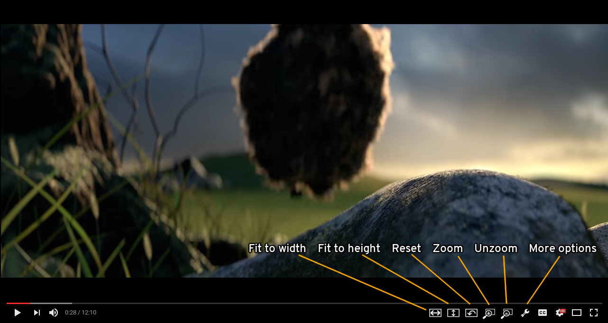
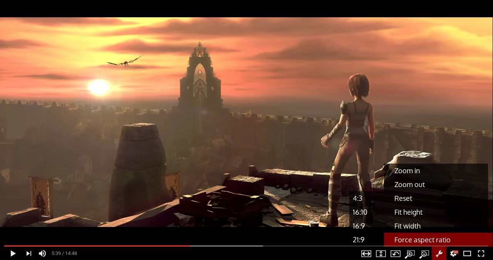

Note: this is v2 branch, which could be utterly broken at any time of the day. If you want something stable, go and look at master.

# Ultrawidify — aspect ratio fixer for youtube and netflix

## TL;DR

If you own an ultrawide monitor, you have probably noticed that sometimes videos aren't encoded properly — they feature black bars on all four sides. This could happen because someone was incompetent (note: as far as youtube is concerned, improperly rendered videos might be due to youtube's implementation of certain new features). The extension kinda fixes that by doing this:

Works on Youtube and Netflix. Available for [Firefox (v1.2.1)](https://addons.mozilla.org/en/firefox/addon/ultrawidify/) and [Chrome (v1.2.1)](https://chrome.google.com/webstore/detail/ultrawidify/dndehlekllfkaijdlokmmicgnlanfjbi).

## The long version

The technology has been here for a while, but plenty of people don't know how to properly encode a video (despite the fact [youtube has an article that explains aspect ratios](https://support.google.com/youtube/answer/6375112)). Plenty of people surprisingly includes major Holywood studios, such as [Marvel](https://www.youtube.com/watch?v=Ke1Y3P9D0Bc), [Disney](https://www.youtube.com/watch?v=yCOPJi0Urq4), [Dreamworks](https://www.youtube.com/watch?v=oKiYuIsPxYk), [Warner Brothers](https://www.youtube.com/watch?v=VYZ3U1inHA4), [Sony](https://www.youtube.com/watch?v=7BWWWQzTpNU), et cetera. You'd think that this is the one thing Holywood studios and people who make [music videos for a living](https://www.youtube.com/watch?v=c6Mx2mxpaCY) would know how to do right, but they don't. This extension is here to fix that.

## Features

* **Adds UI to the player's controls**
* **Fit video to width/height**
* **Zoom/unzoom video**
* **Force specific aspect ratio**
* **(Attempt to) autodetect aspect ratio** (Netflix only)
* **Rebindable shortcuts**

### User interface

To be entirely fair to the blender foundation, the video featured above is properly encoded. (However, few accounts that reposted it didn't sport the same levels of competence).

The 'more settings' menu contains all the buttons on the control bar, plus an option to force a specific aspect ratio — in case you're trying to watch a 16:9 video, that's encoded as 4:3 video, on a 21:9 monitor.

These options might show some benefit for people not using 21:9 monitors, as they would allow you to crop a (proper) 21:9 to 16:9 (remove black bars at the cost of some video). 'Fit to height' would often do the same job, though.

### Default keyboard shortcuts

    w   - fit to width
    e   - fit to height
    r   - reset
    z   - zoom
    u   - unzoom
    
    a   - attempt to automatically determine the aspect ratio (netflix only)
    
    s   - force 21:9
    d   - force 16:9
    x   - force 16:10
    c   - force 4:3

### About Netflix aspect ratio autodetection

Automatic aspect ratio detection on Netflix works by grabbing the title of the video off Netflix' control bar and throws it at some third party services. First, it takes the title and throws it at OMDB. OMDB replies with IMDB id. We then throw that id at IMDB, which replies with 1700+ lines (and aspect ratio information is hopefully somewhere among them). If OMDB doesn't find the movie — or if the IMDB doesn't have information about aspect ratio for that particular title — automatic detection fails. There's also a posibility that this method returns the wrong data, as there's a possibility that multiple movies share the same title.

For best results with autodetection, please make sure the following requirements are met:

* Netflix, not youtube
* Netflix must be in English
* Movie title must be in English/the original title
* Movie must be known by OMDB
* Movie must have aspect ratio info on IMDB

## Installing

### Permanent install / stable

[v1.2.1 — Regular version — download from AMO](https://addons.mozilla.org/en/firefox/addon/ultrawidify/)

[v1.2.1 — Regular version — download from Chrome store](https://chrome.google.com/webstore/detail/ultrawidify/dndehlekllfkaijdlokmmicgnlanfjbi)

### Installing the current, github version

1. Clone this repo
2. Open up Firefox
3. Go to `about:debugging`
4. Add temporary addon
5. Browse to wherever you saved it and select manifest.json

## Known issues (in stable versions)

'More settings' button actually doesn't work at the moment.

## Plans for the future

* ~~Adding custom keybinds~~ (done at lastest)
* ~~Adding a proper settings page~~ (done at last)
* ~~Adding buttons for actions in youtube's player~~ (kinda done)
* ~~Adding an option to force specific aspect ratio~~ (now it's "good enough")
* ~~Port to Chrome~~
* ~~Have extension remember the last setting when switching between fullscreen and not fullscreen.~~ (kinda done)
* Have an option to remember last selected aspect ratio.
* Option to hide UI
* ~~Netflix support~~ (done)

## Changelog

###v1.3a1  (git/current version)

* Adding ability to add custom sites (in progress)
* Most of the extension is being completely rewritten to accomodate that feature, which means there's a serious regression with Netflix support (no netflix at the moment)
* I'm also trying to break the 1500 line behemoth into smaller files.

###v1.2.1  (AMO + Chrome)

* Fixed the bugs which caused aspect ratio to not be calculated properly.
* Introduced further changes that allow me to not keep two separate version for Firefox and Chrome.

###v1.2.0

* Auto-aspect ratio detection on netflix
* initial port to Chrome

###v1.1.1

* Fixed zooming issue on netflix
* Ultrawidify shortcuts > youtube/netflix shortcuts
* Fixed 'settings' page
* Fixed 'settings' (wrench button) popup on youtube (it was broken by one of the previous updates)

###v1.1.0

 * Introduced Netflix support.
 
As Netflix relies on extension re-initializing at least the UI ***a lot***, the optimization introduced in 1.0.2 was reversed (as waiting 2 seconds for the UI to appear is just too much). 

Furthermore, triggering UI re-initialisation on onUpdated events turned out to not be the proper way to go: immediately after the extension is initialized, onUpdated gets triggered even more often than your average Buzzfeed writer/reader. But change the episode on Netflix and suddenly, onUpdated gets barely triggered at all — which means that more often than not, the UI extension injects into the page wasn't visible. (the fuck, really)

This is why Netflix uses another function that manually checks whether the player bar is present. Ideally that check happens every tenth of a second, but Firefox may be limiting that to one per second.

###v1.0.2  

The 'extension sometimes not working' bug was fixed (by having extension try to setup every time a page got updated), but the fix had some problems. Namely, the extension would re-initiate (complete with re-adding the entire UI) itself very _very_ often. 

This could be a problem, so it was fixed. Extension is notified of updates only every ~2 seconds (which absorbs most of the "page was updated" events on page load) and doesn't attempt to reload the UI if the UI was already loaded. (Unless `debugmsg` is set to true. It's generally not, but any commits to this repo could potentially still have it enabled).

###v1.0.1

Fixed the bug where sometimes the extension would fail to work. (example: you opened youtube's search page in a brand new tab. You then opened a video from the search results (_not_ in a new tab). Extension wouldn't work at all in videos opened in that manner).

###v1.0.0

* Is pretty much rc1, except slightly different background image.

###v1.0-rc1

* Settings page is added and mostly working. 

###v0.9.9.6

* The issue with buttons not fitting in the control bar was resolved.

###v0.9.9.5

* Played with settings and localstorage a bit, but no clear implementation yet.
* Fixed some bugs caused by event propagation.
* All buttons in the player's control bar are now also in the settings popup.
* Had to scrap settings page in its current form
* TODO: sometimes not all buttons can fit in the control bar. Such occurences should be detected.

###v0.9.9.1

* Keybinds `a` and `w` now work. 
* Some changes under the bonnet, mostly regarding the way keypresses are handled.
* 'Settings' page is ~15% done.

###v0.9.9

* The aspect ratio thingy is now also in GUI
* Fixed code for forcing aspect ratio. At least I think it's fixed now.

###v0.9.8

* Added GUI/buttons on the player.
* Script now only loads on youtube pages (iframes included) (before, this script would run on any page)

###v0.9.7

* No new features added. Version number got incremented due to an attempt at autoupdating (which got foiled due to lack of HTTPS)

###v0.9.6

* Added experimental feature that tries to force an aspect ratio

###v0.9.1

* First version on GitHub (and on AMO) with basic features (zoom, fit to width, fit to height)
