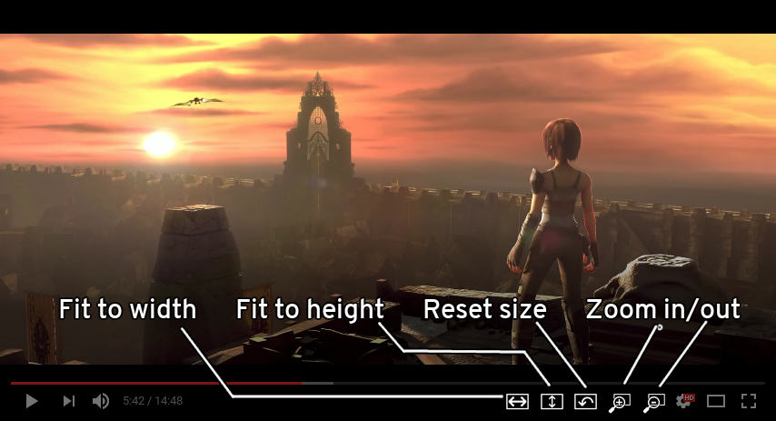
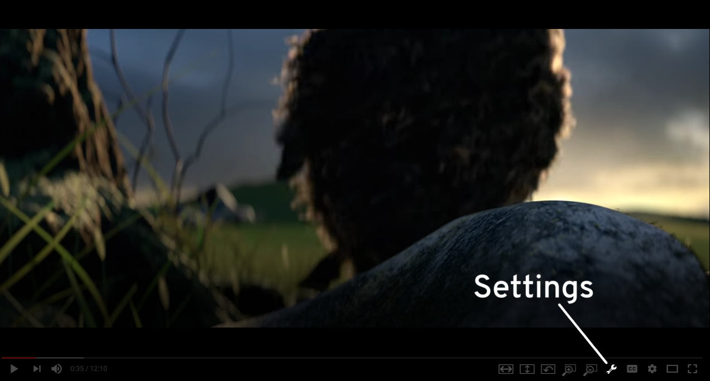

# Ultrawidify — youtube aspect ratio fixer for firefox

## What does it do?

The technology has been here for a while, but plenty of people don't know how to properly encode a video (despite the fact [youtube has an article that explains aspect ratios](https://support.google.com/youtube/answer/6375112)). Plenty of people surprisingly includes major Holywood studios, such as [Marvel](https://www.youtube.com/watch?v=Ke1Y3P9D0Bc), [Disney](https://www.youtube.com/watch?v=yCOPJi0Urq4), [Dreamworks](https://www.youtube.com/watch?v=oKiYuIsPxYk), [Warner Brothers](https://www.youtube.com/watch?v=VYZ3U1inHA4), [Sony](https://www.youtube.com/watch?v=7BWWWQzTpNU), et cetera. You'd think that this is the one thing Holywood studios and people who make [music videos for a living](https://www.youtube.com/watch?v=c6Mx2mxpaCY) would know how to do right, but they don't. This extension is here to fix that.

### TL;DR: it does this:

I'd demo with [Sintel](https://www.youtube.com/watch?v=eRsGyueVLvQ) but they encoded the video without the black bars. ~~Thanks, Blender Foundation.~~ Actually they're not off the hook.

This extension also allows you to zoom in or out of video (similar to how SMPlayer does it).

## Installing

### Temporary install

1. Clone this repo
2. Open up Firefox
3. Go to `about:debugging`
4. Add temporary addon
5. Browse to wherever you saved it and select manifest.json

### Permanent install

[v1.0-rc1 — Experimental version — download from here](http://tamius.net/ultrawidify) — If 30 minutes old is stable enough for you, this is it. This version is pretty much code from this repo. It's also unlisted so I don't have to go through AMO for every minor change. It hasn't been tested whether autoupdating works, and it probably doesn't.

[v1.0.0 — Regular version — download from AMO](https://addons.mozilla.org/en/firefox/addon/ultrawidify/) — more stable and with AMO's approval. No experimental features either.

**NOTE:** Have only one version of the extension running at a time. Don't run both at the same time.

## How do I use it?

This is the interface:

And that's the keybinds for the actions displayed:

* `w` : fit to width (will crop top and bottom if video is taller than the display)
* `e` : fit to height (will crop left and right if video is wider than the display)
* `z` : zoom
* `u` : unzoom
* `r` : reset to default

As of version 0.9.6, there's also experimental feature that will try to force an aspect ratio for the video. You specify the aspect ratio of the video you're watching. Extension then looks at the actual aspect ratio of the video. If aspect ratios are different, extension assumes that video contains black borders and zooms in on the video, so the black bars are removed. For example: if the video you're watching is 4:3, but you specify it's actually 16:9, then the extension will zoom on 16:9 section inside that video. 

As of 0.9.9, option to force aspect ratio is available from settings. That's this button:

If you can read this, you'll probably figure out the rest of the way.

¹These ratios are calculated using the number in the brackets, as 1920/1080 does not strictly equal to 16/9 (same goes for 21:9).

## What works

More or less everything. Works regardless of whether the video is in fullscreen or not. Works regardless if the youtube video you're watching is embedded on some other page.

## What doesn't

At the moment, I'm not aware of anything that this extension advertises not working.

## Plans for the future

* ~~Adding custom keybinds~~ (done at lastest)
* ~~Adding a proper settings page~~ (done at last)
* ~~Adding buttons for actions in youtube's player~~ (kinda done)
* ~~Adding an option to force specific aspect ratio~~ (now it's "good enough")
* Port to Chrome
* Have extension remember the last setting when switching between fullscreen and not fullscreen. Have an option to remember last selected aspect ratio.
* Netflix support

## Changelog

###v1.2.0  (this repo, unstable as fuck)

* After an afternoon's worth of work, I managed to get the Rube Goldberg machine (that automagically removes unnecessary black borders on ultrawide videos — on netflix only) working for a few moments before the background script crashed. Now that feature only needs a bit of a polish (and by 'a bit', I mean a metric ton of it). gg

###v1.1.1  (waiting for approval)

* Fixed zooming issue on netflix
* Ultrawidify shortcuts > youtube/netflix shortcuts
* Fixed 'settings' page
* Fixed 'settings' (wrench button) popup on youtube (it was broken by one of the previous updates)

###v1.1.0  (latest version on AMO)

 * Introduced Netflix support.
 
As Netflix relies on extension re-initializing at least the UI ***a lot***, the optimization introduced in 1.0.2 was reversed (as waiting 2 seconds for the UI to appear is just too much). 

Furthermore, triggering UI re-initialisation on onUpdated events turned out to not be the proper way to go: immediately after the extension is initialized, onUpdated gets triggered even more often than your average Buzzfeed writer/reader. But change the episode on Netflix and suddenly, onUpdated gets barely triggered at all — which means that more often than not, the UI extension injects into the page wasn't visible. (the fuck, really)

This is why Netflix uses another function that manually checks whether the player bar is present. Ideally that check happens every tenth of a second, but Firefox may be limiting that to one per second.

###v1.0.2  

The 'extension sometimes not working' bug was fixed (by having extension try to setup every time a page got updated), but the fix had some problems. Namely, the extension would re-initiate (complete with re-adding the entire UI) itself very _very_ often. 

This could be a problem, so it was fixed. Extension is notified of updates only every ~2 seconds (which absorbs most of the "page was updated" events on page load) and doesn't attempt to reload the UI if the UI was already loaded. (Unless `debugmsg` is set to true. It's generally not, but any commits to this repo could potentially still have it enabled).

###v1.0.1

Fixed the bug where sometimes the extension would fail to work. (example: you opened youtube's search page in a brand new tab. You then opened a video from the search results (_not_ in a new tab). Extension wouldn't work at all in videos opened in that manner).

###v1.0.0

* Is pretty much rc1, except slightly different background image.

###v1.0-rc1

* Settings page is added and mostly working. 

###v0.9.9.6

* The issue with buttons not fitting in the control bar was resolved.

###v0.9.9.5

* Played with settings and localstorage a bit, but no clear implementation yet.
* Fixed some bugs caused by event propagation.
* All buttons in the player's control bar are now also in the settings popup.
* Had to scrap settings page in its current form
* TODO: sometimes not all buttons can fit in the control bar. Such occurences should be detected.

###v0.9.9.1

* Keybinds `a` and `w` now work. 
* Some changes under the bonnet, mostly regarding the way keypresses are handled.
* 'Settings' page is ~15% done.

###v0.9.9

* The aspect ratio thingy is now also in GUI
* Fixed code for forcing aspect ratio. At least I think it's fixed now.

###v0.9.8

* Added GUI/buttons on the player.
* Script now only loads on youtube pages (iframes included) (before, this script would run on any page)

###v0.9.7

* No new features added. Version number got incremented due to an attempt at autoupdating (which got foiled due to lack of HTTPS)

###v0.9.6

* Added experimental feature that tries to force an aspect ratio

###v0.9.1

* First version on GitHub (and on AMO) with basic features (zoom, fit to width, fit to height)
