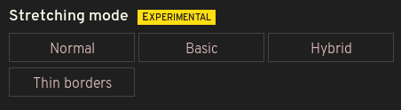

# Ultrawidify — aspect ratio fixer for youtube and netflix

## Super TL;DR: I'm just looking for the install links, thanks

[Firefox](https://addons.mozilla.org/en/firefox/addon/ultrawidify/), [Chrome](https://chrome.google.com/webstore/detail/ultrawidify/dndehlekllfkaijdlokmmicgnlanfjbi).

**Microsoft Edge is not supported at this time, as Edge features some bugs that make it impossible for extension to work.** [Read more](https://github.com/tamius-han/ultrawidify/issues/117#issuecomment-747109695).

There's also [nightly "builds"](https://stuff.lionsarch.tamius.net/ultrawidify/nightly/).

## TL;DR

If you own an ultrawide monitor, you have probably noticed that sometimes videos aren't encoded properly — they feature black bars on all four sides. This could happen because someone was incompetent (note: as far as youtube is concerned, improperly rendered videos might be due to youtube's implementation of certain new features). The extension kinda fixes that by doing this:

## Known issues

* Netflix autodetection not working in Chrome and working poorly in Firefox. This problem happens because DRM, and happens on other sites utilizing DRM protection schemes. Don't expect Chrome support any time soon.
* Everything reported in [issues](https://github.com/tamius-han/ultrawidify/issues)

### Limitations

* Unclear how extension handles sites with more than one video per page.
* Autodetection is only correct 95% of the time, most of the time.
* That new stretching mode wasn't thoroughly tested yet. Issues may be present. (Same with zoom)
* Enabling extension everywhere (as opposed to whitelisted sites) could break some websites.

### Features

* **Can be enabled or disabled on per-site basis**
* **Crop video to fit screen** (no stretching. Supported aspect ratios: 21/9 (1:2.39), 16:9, 16:10. It's possible to set additional aspect ratios, but settings GUI currently contains some mildly annoying bugs)
* **Automatic aspect ratio detection** (can be enabled/disabled entirely or on a per-site basis, separately of the extension. May not work on sites utilizing DRM schemes, such as Netflix et. al.). Autodetection in action: [youtube](https://www.youtube.com/watch?v=j2xn1WpbtCQ))
* **Supports Youtube theater mode**
* **[EXPERIMENTAL!]** Stretch video to fit the screen
* **[EXPERIMENTAL!]** custom zooming and panning

### Officially supported sites

* Youtube
* Netflix
* Twitch

### Other sites

I am not actively testing extension on other sites. You can try your luck and enable extension for any unsupported site you stumble across via extension popup, but I make no guarantees it will work everywhere.

If extension doesn't work for a site I'm not testing on out of the box, follow [this wiki](https://github.com/tamius-han/ultrawidify/wiki/Fixing-site-incompatibilites-('Advanced-settings')). The 'quick and dirty' approach should work for most sites. (If you try doing things the proper way, you should really know what you're doing.)

### Installing this extension

You can download this extension from Firefox' and Chrome's extension stores:

* [Firefox](https://addons.mozilla.org/en/firefox/addon/ultrawidify/)
* [Chrome, Opera](https://chrome.google.com/webstore/detail/ultrawidify/dndehlekllfkaijdlokmmicgnlanfjbi)
* [Chromium Edge](https://microsoftedge.microsoft.com/addons/detail/lmpgpgechmkkkehkihpiddbcbgibokbi)

Users of beta and developer branches of Opera can find Ultrawidify on Opera store as well, but given Opera's review process is unacceptably slow (awaiting moderator review since 2020-03-15) not only am I not going to maintain Opera store presence, Opera users are advised to use Chrome version of the extension in order to avoid waiting years for new features to be approved by Opera moderators.

### Nightly builds

* Nightly builds can be downloaded [here](https://stuff.lionsarch.tamius.net/ultrawidify/) as an unpacked extension that can
only be installed temporarily.

If I did anything during the day, the nightly version will be sorta-built at whatever my VPS provider thinks is 4AM CE(S)T.

# Beggathon (donations)

If you want to support this project, please consider a donation. Working on this extension takes time, money, coffee and motivation. Sometimes also [a very precise amount of alco](https://xkcd.com/323/).

You can make a donation [via Paypal](https://www.paypal.me/tamius).

**Any donation — no matter how big or small — is well appreciated. Thanks.**

&nbsp;

&nbsp;

&nbsp;

&nbsp;

# The long version

The technology has been here for a while, but plenty of people don't know how to properly encode a video (despite the fact [youtube has an article that explains aspect ratios](https://support.google.com/youtube/answer/6375112)). Plenty of people surprisingly includes major Hollywood studios, such as [Marvel](https://www.youtube.com/watch?v=Ke1Y3P9D0Bc), [Disney](https://www.youtube.com/watch?v=yCOPJi0Urq4), [Dreamworks](https://www.youtube.com/watch?v=oKiYuIsPxYk), [Warner Brothers](https://www.youtube.com/watch?v=VYZ3U1inHA4), [Sony](https://www.youtube.com/watch?v=7BWWWQzTpNU), et cetera. You'd think that this is the one thing Hollywood studios and people who make [music videos for a living](https://www.youtube.com/watch?v=c6Mx2mxpaCY) would know how to do right, but they don't. This extension is here to fix that.

## Features

Most settings are self-explanatory, but we'll get into details anyway. 

### Limitations:

Before we go on to features, let's discuss limitations.

* Currently, this extension is only tested on Youtube and Netflix. It should work on other sites as well, but you'll need to manually enable extension on other sites via the popup.
* It's unclear how extension handles sites displaying multiple videos per site. Having multiple videos on the same page is a very tricky case that hasn't been given much thought.
* Autodetection is a very hard problem to solve. Despite various improvements, it's still not 100% correct. In cases where aspect ratio is hard to determine, extension tends to err on the side of caution and tries to avoid changing aspect ratios. However, sometimes aspect ratio changes will still trigger too eagerly.

### Automatic aspect ratio detection

By default, automatic detection will run on every site this extension is enabled for. It does what it says on the tin: it attempts to detect aspect ratio of the video by periodically looking at a video frame.

Some caveats apply:
* autodetection is very easy in 99% of cases and very tricky in the 1%. Sometimes, autodetection will be too eager. Sometimes it won't be eager enough.
* Some sites use DRM. DRM measures are designed specifically to prevent scripts from looking at video frames. Since that's exactly what this extension uses to determine aspect ratio of a video, **autodetection is not possible on sites that use DRM** (Netflix and the likes). Firefox is slight exception to this.
* Firefox offers an API that can be used to take screenshots of the page. Turns out that you can use this API to work around the above limitation. Usage of this API has its own limitations. Due to those limitations, automatic detection on DRM-protected sites in Firefox keeps a thin black bar at the top and the bottom of the video.

Autodetection can be enabled or disabled globally, per site or per video.

### Popup

Most of the extension settings can be accessed and modified via the popup. If extension is enabled for the site you're currently on, the popup will display options for the video you're currently watching.

### Cropping video

Extension can crop videos to the desired aspect ratio. Options offered by the extension are (keyboard shortcuts in **bold**):

* Automatic — **A**
* Reset (default) — **R**
* 21:9 (2.39:1) — **D**
* 18:9 (2:1) — **X**
* 16:9 (1.77) — **S**
* Custom — **Q**

In addition to that, you can crop video to fit width (**W**) or height (**E**).

**Note:** manually adjusting aspect ratio _disables_ autodetection for current video. Manual adjustments are temporary and should last for only one video.

You can set custom aspect ratio by clicking 'set custom aspect ratio' link under the buttons, changing the value in the box and clicking 'save'. Aspect ratio can be in any of the following formats:
 * `width/height` (e.g. `16/9`, `21/9` - even `2560/1080`)
 * `1:ratio` (e.g. `1:2.39`. You can omit the `1:` part, too — e.g. `2.39` is equivalent to `1:2.39`)
'Save' button saves your custom aspect ratio. If you don't save changes, they'll be forgotten by the time you close the popup.

### Zoom

Keys 'Z' and 'U' manually zoom the video. You can use those to zoom farther than merely adjusting aspect ratio would. At high magnification, you can pan the video by moving mouse over it. Panning is off by default and can be activated by holding 'shift' or toggled by pressing 'P' key.

You can also zoom video by using the slider in the popup:

### Align video

If you watch 16:9 videos in full screen on a 21:9 monitor, there's obviously going to be black bars on either side of the video. The video will be centered, though. Some people don't want video to be centered in such situations, instead preferring having the video aligned to either side. **Video alignment** option does that.

### Stretching videos

When you watch a 16:9 content on a 21:9 monitor, you can deal with this issue in three ways: A) you don't, B) you crop or C) you stretch the 16:9 video to fit a 21:9 container. Obviously not everyone is a person of culture, some people prefer to choose the greater evil of the three: they prefer their videos stretched!

Ultrawidify offers you several ways of dealing with the issue:
* **Never** — don't stretch at all
* **Basic** — stretch the video to fit screen. Doesn't remove black bars encoded in the video. While this option is active, automatic aspect ratio detection is disabled.
* **Hybrid** — this mode first crops away the black bars encoded in the video file. If the video doesn't fit your monitor after being cropped, the extension will proceed to stretch it in a smart way. Automatic detection remains active with this option.
* **Thin borders** — this mode only applies stretching only when borders around video are thin (less than 5% of total width or height).

## Global and per-site default settings

You can change default settings for extension or site you're currently on by visiting 'Extension settings' and 'Site settings' tabs in the popup. Per-site settings override extension defaults, video settings override both. Both tabs also have the same options:

Quick rundown of the options:

* **Enable this extension** (Extension settings)

Whether the extension is enabled. Options:

`Always` — allow this extension to run on every site (unless the site is blacklisted)  
`On whitelisted sites` — allow this extension to run only on sites you manually enabled  
`Never` — this extension won't work. At all. 

* **Enable autodetection** (Extension settings)

Whether extension should automatically detect aspect ratio. Uses same options as _Enable this extension_ options.

* **Enable this extension** (Site settings)

Whether the extension is enabled on current site. Options:

`Whitelist` — allow this extension to run on current site.  
`Default` — follow global settings (allow if global option is set to 'always', don't allow if global option is set to any of the other two)  
`Blacklist` — never allow extension to run on current site.

* **Enable autodetection** (Site settings)

Whether extension should automatically detect aspect ratio on current site. Uses same options as _Enable this extension_ options.

* **Default stretching mode**

How, if at all, should extension stretch the video by default. 

* **Video alignment**

How to align the video by default.

## Keyboard shortcuts

The keyboard shortcuts have already been listed, but let's list them all again in the same, handy place.

### Default keyboard shortcuts

`w`   - fit to width  
`e`   - fit to height  
`r`   - reset

`a`   - attempt to automatically determine the aspect ratio 

`s`   - force 16:9  
`d`   - force 21:9  
`x`   - force 18:9  
`q`   - force custom aspect ratio

`z`   - zoom
`u`   - unzoom
`p`   - toggle video panning
`shift`- pan video (while holding)

### Rebinding keyboard shortcuts

is currently not possible. Settings page for this extension has been disabled sometime with 2.0 release (because it [broke](https://github.com/tamius-han/ultrawidify/issues/16)), and fixing the setting page has been very low priority as I've had more important issues to work on. 

However, I do plan on implementing this feature. Hopefully by the end of the year, but given how consistently I've been breaking self-imposed deadlines and goals for this extension don't hold your breath. After all, [Hofstadter's a bitch](https://en.wikipedia.org/wiki/Hofstadter%27s_law).

## Plans for the future

1. Handle porting of extension settings between versions. 
2. ~~Reintroduce gradual zoom on z and u and provide a way to 'scroll' the zoomed in video up/down left/right.~~ (v3.2.0)
3. reintroduce settings page (rebindable keys, blacklist/whitelist management, some settings for automatic aspect ratio detection)
4. site-specific options for sites that require additional CSS classes or other hacks
5. figure the best way to do GUI (injecting buttons into the player bar is not a good way. Been there, done that, each site has its own way and some appear to be impossible). ~~Might get bumped to be released alongside #2~~no it wont lol
6. Improvements to automatic aspect ratio detection

## Installing

### Permanent install / stable

[Latest stable for Firefox — download from AMO](https://addons.mozilla.org/en/firefox/addon/ultrawidify/)

[Latest stable for Chrome — download from Chrome store](https://chrome.google.com/webstore/detail/ultrawidify/dndehlekllfkaijdlokmmicgnlanfjbi)

Edge version is currently not available, as Edge has some bugs that prevent this extension from working correctly. [Read more](https://github.com/tamius-han/ultrawidify/issues/117#issuecomment-747109695)
<!-- [Latest stable for Edge — Download from Microsoft store](https://microsoftedge.microsoft.com/addons/detail/lmpgpgechmkkkehkihpiddbcbgibokbi) -->

### Installing the current, github version

## Get pre-built version:

TODO

## Build from source

Requirements: npm, node.

1. Clone this repo
2. run `npm install`
3. If using **Firefox,** run: `npm run watch:dev`. If using **Chrome,** run: `npm run watch-chrome:dev`.

TODO: see if #3 already loads the extension in FF

2. Open up Firefox (or Chrome)
3. Go to `about:debugging` (or Chrome equivalent)
4. Add temporary addon
5. Select `${ultrawidify_folder}/dist/manifest.json`

# Changelog

see changelog.md

todo: add link to changelog.md here
