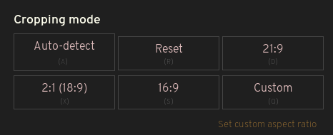

# Ultrawidify — aspect ratio fixer for youtube and netflix

## TL;DR

If you own an ultrawide monitor, you have probably noticed that sometimes videos aren't encoded properly — they feature black bars on all four sides. This could happen because someone was incompetent (note: as far as youtube is concerned, improperly rendered videos might be due to youtube's implementation of certain new features). The extension kinda fixes that by doing this:

### Limitations

* Unclear how extension handles sites with more than one video per page.
* Autodetection is only correct 95% of the time, most of the time.
* That new stretching mode wasn't thoroughly tested yet. Issues may be present.
* Enabling extension everywhere (as opposed to whitelisted sites) could break some websites. 

### Features

* **Can be enabled or disabled on per-site basis**
* **Crop video to fit screen** (no stretching. Supported aspect ratios: 21/9 (1:2.39), 16:9, 16:10, _one (1) custom aspect ratio_)
* **Automatic aspect ratio detection** (can be enabled/disabled entirely or on a per-site basis, separately of the extension. Autodetection in action: [youtube](https://www.youtube.com/watch?v=j2xn1WpbtCQ))
* **[NEW in v3!] Stretch video to fit the screen** (4 different approaches)
* **Supports Youtube theater mode**

### Officially supported sites

* Youtube
* Netflix

### Other sites

I am not actively testing extension on other sites. You can try your luck and enable extension for any unsupported site you stumble across via extension popup (in the _Setting for this site_ menu), but I make no guarantees it will work everywhere.

### Installing this extension

You can download this extension from Firefox' and Chrome's extension stores:

* [Firefox](https://addons.mozilla.org/en/firefox/addon/ultrawidify/) (v3.0.0) 
* [Chrome](https://chrome.google.com/webstore/detail/ultrawidify/dndehlekllfkaijdlokmmicgnlanfjbi) (v2.2.5-ish)

### Beggathon

Working on this extension takes time, coffee and motivation. If you want to buy me a beer or something, you can [use this link to send me motivation](https://www.paypal.me/tamius). **Any donations are well appreciated.**

&nbsp;

&nbsp;

&nbsp;

&nbsp;

# The long version

The technology has been here for a while, but plenty of people don't know how to properly encode a video (despite the fact [youtube has an article that explains aspect ratios](https://support.google.com/youtube/answer/6375112)). Plenty of people surprisingly includes major Holywood studios, such as [Marvel](https://www.youtube.com/watch?v=Ke1Y3P9D0Bc), [Disney](https://www.youtube.com/watch?v=yCOPJi0Urq4), [Dreamworks](https://www.youtube.com/watch?v=oKiYuIsPxYk), [Warner Brothers](https://www.youtube.com/watch?v=VYZ3U1inHA4), [Sony](https://www.youtube.com/watch?v=7BWWWQzTpNU), et cetera. You'd think that this is the one thing Holywood studios and people who make [music videos for a living](https://www.youtube.com/watch?v=c6Mx2mxpaCY) would know how to do right, but they don't. This extension is here to fix that.

## Features

Most settings are self-explanatory, but we'll get into details anyway. 

### Limitations:

Before we go on to features, let's discuss limitations.

* Currently, this extension is only tested on Youtube and Netflix. It should work on other sites as well, but you'll need to manually enable extension on other sites via the popup.
* It's unclear how extension handles sites displaying multiple videos per site. Having multiple videos on the same page is a very tricky case that hasn't been given much thought.
* Autodetection is a very hard problem to solve. Despite various improvements, it's still not 100% correct. In cases where aspect ratio is hard to determine, extension tends to err on the side of caution and tries to avoid changing aspect ratios.
* This extension only works one way. It removes horizontal bars encoded in the video. It can't remove vertical bars encoded in the video. Especially not with autodetection.

### Turn extension on and off, on per-site basis

This is pretty straight-forward. Under **enable this extension** section, selecting `always` will ensure the extension runs on every site you visit. That unfortunately breaks some sites, so by default Ultrawidify will only run on the sites you manually enabled (`On whitelisted sites`). `Never` means extension is disabled for all sites.

In the **Options for this site** section, there's some sidenotes to be had:

* `Blacklist` option ensures extension _never_ runs on the site you're currently on.
* `Default` will do whatever the global option is: if 'enable this extension' is set to `always`, then extension will work on the given site. Otherwise, it won't.
* `Whitelist` ensures extension always runs on the site you're currently on, unless extension is disabled via previous option.

### Automatic aspect ratio detection

There's a few caveats to automatic aspect ratio detection. Namely, it only works on HTML5 videos (but who doesn't use HTML5 these days?). If videos on the site are DRM-protected (e.g. Netflix), autodetection will not work unless you're using Firefox (and even then, no guarantees). Video demonstration of autodetection can be found [here](https://www.youtube.com/watch?v=j2xn1WpbtCQ). 

Top row of buttons determines the default mode of operation for automatic detection.

* **Always** — works on all sites this extension is enabled on, unless autodetection is specifically disabled for that site. [Default]
* **Only on whitelisted sites** — autodetection only works on sites, on which autodetection is enabled.
* **Never** — turn aspect ratio detection off

Bottom row of buttons detemrmines the mode of operation for automatic detection for current site. 

* **Blacklist** — don't ever attempt automatic aspect ratio detection on this site
* **Default** — follow global rules. If default mode of operation is 'always', automatic aspect ratio detection will work on this site, otherwise it won't.
* **Whitelist** — perform automatic detection on given site, unless automatic aspec ratio detection is turned off 

'Check every ___ ms box determines how often the extension will check for aspect ratio changes. Longer periods will result in this extension using less system resources, but extension will be slow to detect changes. Short periods will increase the use of system resources. Periods shorter than 500 ms will significantly increase RAM and CPU usage. **Time periods shorter than 100 _will_ result in _massive_ RAM usage due to technical limitations of Javascript and canvas API. To give a solid example, setting this value to '30' ms can result in multiple _gigabytes_ of RAM used (personal record is 7 GB, but the number is very dependant on multiple factors, such as what browser are you using and how long the browser has been running. In Firefox 56, the amount of RAM used was correlated with amount of time the browser has been running).

By default, extension is set to check for aspect ratio changes once every 666 ms, as it turned out to be a decent compromise between RAM usage (generally well under 500 MB) and the time it takes extension to react to aspect ratio changes.

### Cropping video

Buttons in the **cropping mode** set how the video will be cropped. For example: clicking 21:9¹ button will crop the video so it fits 21:9 area. It's not "proper" crop — this option won't magically cause letterbox to appear on 16:9 videos viewed on 16:9 player.
Special buttons in cropping mode:

* **Reset** undoes any aspect ratio changes either you or autodetection made to the video.
* **Auto detect** starts autodetection (even on blacklisted sites)
* **Custom** applies crop to custom aspect ratio

Note that manually adjusting aspect ratio _disables_ autodetection for current video. Manual adjustments are temporary and should last for only one video.

**Custom aspect ratio** is a box in which you enter your custom aspect ratio. It can be in any of the following formats:
 * `width/height` (e.g. `16/9`, `21/9` - even `2560/1080`)
 * `1:ratio` (e.g. `1:2.39`. You can omit the `1:` part, too — e.g. `2.39` is equivalent to `1:2.39`)
'Save' button saves your custom aspect ratio. If you don't save changes, they'll be forgotten by the time you close the popup.

If you watch 16:9 videos in full screen on a 21:9 monitor, there's obviously going to be black bars on either side of the video. The video will be centered, though. Some people don't want video to be centered in such situations, instead preferring having the video aligned to either side. **Video alignment** option does that.

--
¹21:9 is a marketing buzzword. It's an approximation of the following aspect ratios: `1:2.35` and `1:2.39` (as far as videos go). 21:9 option presumes 1:2.39. 
²Vertically centered relative to the source video

### Stretching videos

When you watch a 16:9 content on a 21:9 monitor, you can deal with this issue in three ways: A) you don't, B) you crop or C) you stretch the 16:9 video to fit a 21:9 container. Obviously not everyone is a person of culture, some people prefer to choose the greater evil of the three: they prefer their videos stretched!

As of v3.0, Ultrawidify does stretching. In fact, it offers you several ways of dealing with the issue:
* **Never** — don't stretch at all
* **Basic** — stretch the video to fit screen. Doesn't remove black bars encoded in the video. While this option is active, automatic aspect ratio detection is disabled.
* **Hybrid** — this mode first crops away the black bars encoded in the video file. If the video doesn't fit your monitor after being cropped, the extension will proceed to stretch it in a smart way. Automatic detection remains active with this option.
* **Thin borders** — this mode only applies stretching only when borders around video are thin (less than 5% of total width or height).

## Keyboard shortcuts

They still aren't rebindable.

### Default keyboard shortcuts

`w`   - fit to width  
`e`   - fit to height  
`r`   - reset

`a`   - attempt to automatically determine the aspect ratio 

`s`   - force 16:9  
`d`   - force 21:9  
`x`   - force 18:9  
`q`   - force custom aspect ratio

## Installing

### Permanent install / stable

[Latest stable for Firefox — download from AMO](https://addons.mozilla.org/en/firefox/addon/ultrawidify/) (v3.0.0)

[Latest stafle for Chrome — download from Chrome store](https://chrome.google.com/webstore/detail/ultrawidify/dndehlekllfkaijdlokmmicgnlanfjbi) (v2.2.5)

### Installing the current, github version

1. Clone this repo
2. Open up Firefox
3. Go to `about:debugging`
4. Add temporary addon
5. Browse to wherever you saved it and select manifest.json

## Known issues

* Netflix autodetection not working in Chrome, wontfix as issue is fundamentally unfixable. (Although a different kind of workaround could probably be put in place, but don't count on it)
* Everything reported in [issues](https://github.com/xternal7/ultrawidify/issues)

## Plans for the future

1. ~~Handle porting of extension settings between versions. (Some people had some issues where extension broke until reinstalled, and corrupted settings seemed to be the problem.)~~ seems to work for me?
2. Reintroduce gradual zoom on z and u and provide a way to 'scroll' the zoomed in video up/down left/right.
3. reintroduce settings page (rebindable keys, blacklist/whitelist management, some settings for automatic aspect ratio detection)
4. site-specific options for sites that require additional CSS classes or other hacks
5. figure the best way to do GUI (injecting buttons into the player bar is not a good way. Been there, done that, each site has its own way and some appear to be impossible). Might get bumped to be released alongside #2
6. ~~Stretch mode, because some people are very salty and toxic about the fact that this extension is here to solve a problem that's different than the one they want. More salty than me rn.~~ done 
7. Improvements to automatic aspect ratio detection

## Changelog

see changelog.md

todo: add link to changelog.md here